## Kotlin Multiplatform (KMP): An Introduction
Slide link: https://ravikrs.github.io/kmp-demo/

GH repo link: https://github.com/ravikrs/KMPDemo

---

### What is Kotlin Multiplatform?
- Enabled development of cross platform project
- Allows sharing common code between different platforms.
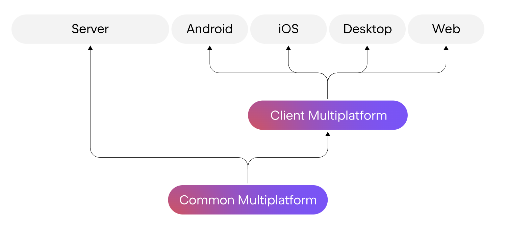

---
## Supported Platforms
- **Mobile**: Android, iOS.
- **Web** (alpha): Kotlin/JS/WebAssembly.
- **Desktop**: macOS, Linux, Windows.
- **Server**: Kotlin/JVM/Ktor for server development.

---
### Why Use KMP?
- Separate codebases for Android, iOS, and other platforms.
- Duplicate effort for business logic and other core functionality.
- "Duplication my be the root of all evil in software" - Robert C. Martin

---
## Multiplatform Advantages:
- Code reusability.
- Reduced development effort.

---
## Code Sharing
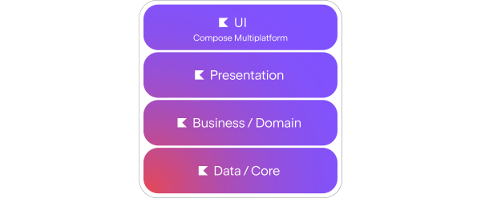

### Shared Code:
- Business logic.
- Networking.
- Data persistence.

### Platform-Specific Code:
- UI interactions.
- Native platform APIs (camera, GPS, etc.).

### No Code sharing
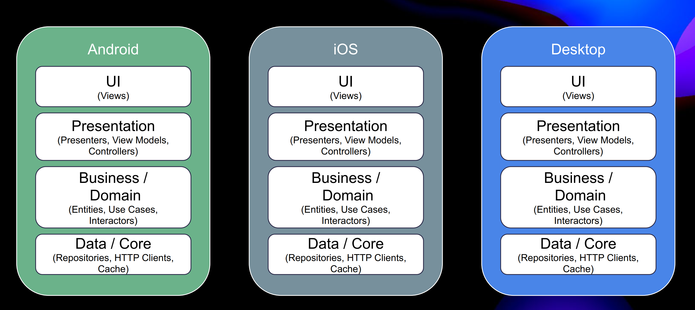

### Sharing Domain
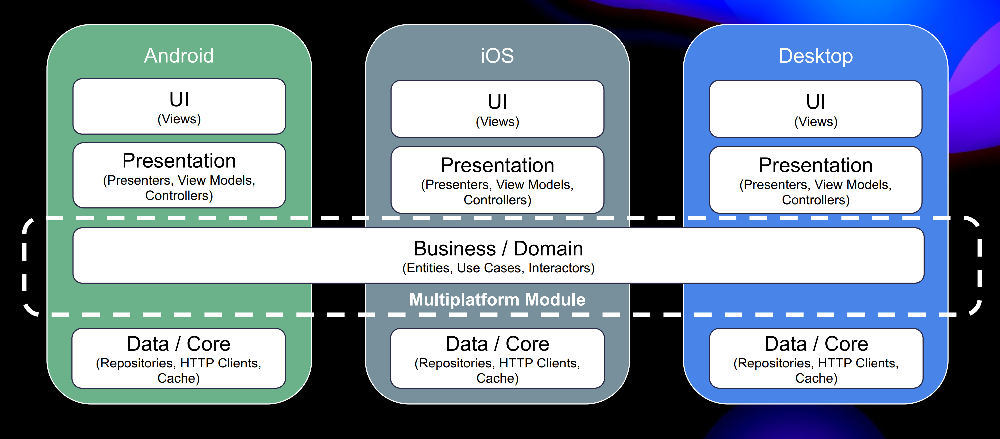

### Sharing Domain and Data
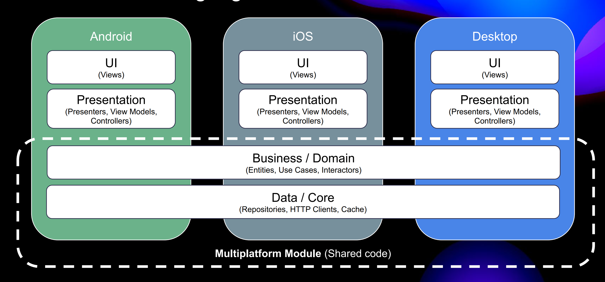

### Sharing Domain, Data and Presentation
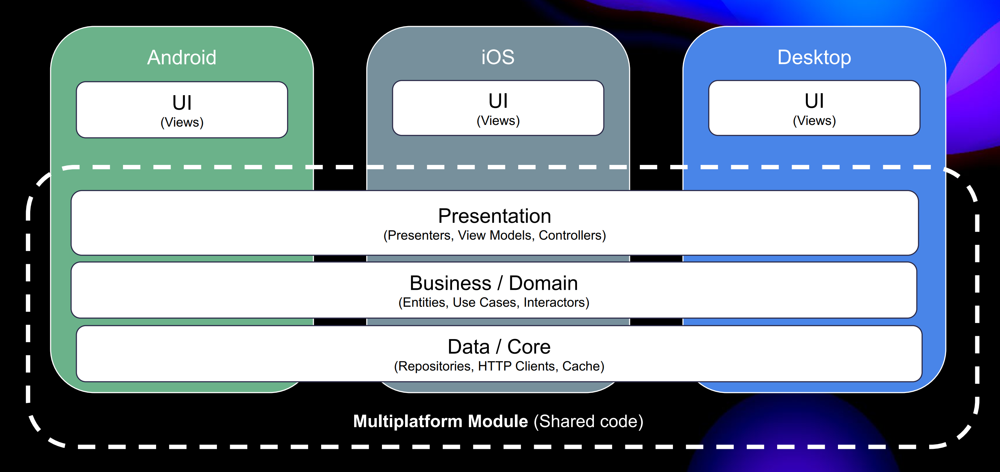

### Expect/Actual Mechanism:
- `expect` keyword declares platform-agnostic APIs.
- `actual` keyword provides platform-specific implementations.
  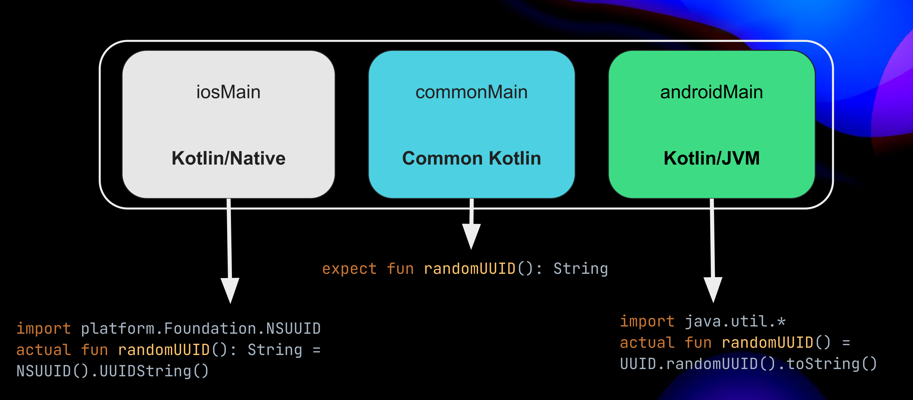

---

### KMP Libraries:
- Rich set of KMP libs: [KMP Awesome](https://github.com/terrakok/kmp-awesome) lists all KMP libs
- e.g. **Ktor** for networking., **SQLDelight** for cross-platform database access, etc

---

## Usage in the industry
- Netflix, 9GAG, Meetup, etc
- [Few companies using KMP](https://www.jetbrains.com/help/kotlin-multiplatform-dev/case-studies.html)
---

### Summary:
- Kotlin Multiplatform provides a flexible approach to cross-platform development
- Focus is on business logic sharing.

---
## Workshop
### Built a hello world KMP app for iOS, Android, Desktop and Web
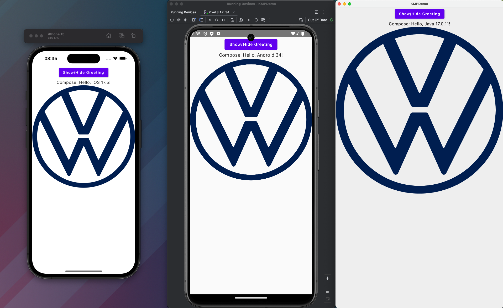

### Sharing resources across multiple platforms
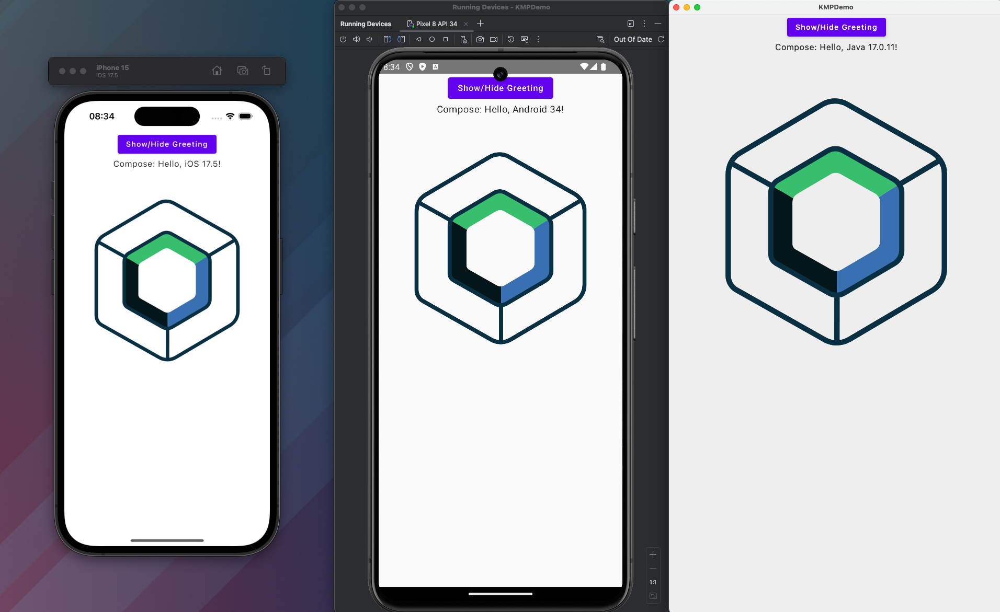

### Using KMP lib to develop shared logic/UI
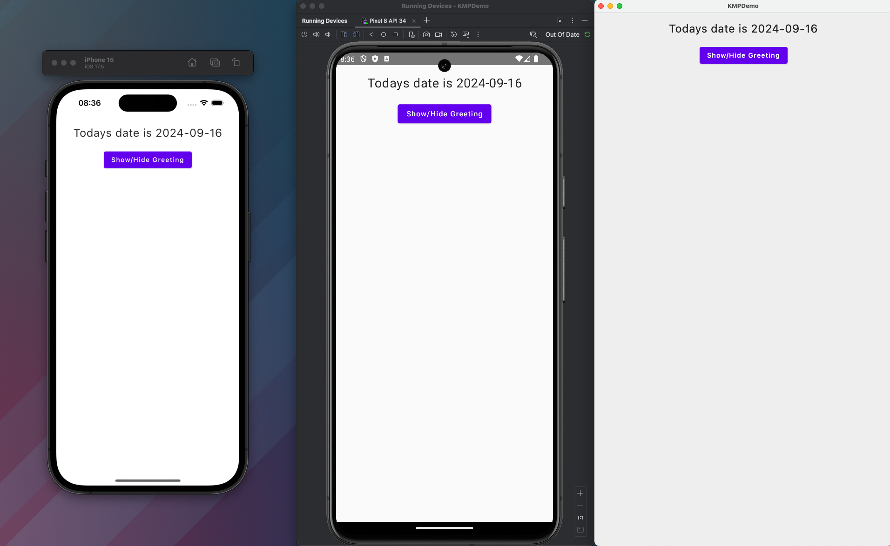

### Shared domain/data/presentation/ui
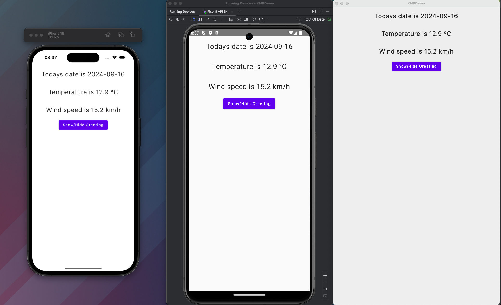

---
## Thank you
### Links
- [Slides](https://ravikrs.github.io/kmp-demo/)
- [Demo App](https://github.com/ravikrs/KMPDemo)
- [KMP Wizard](https://kmp.jetbrains.com/)
- [KMP Awesome](https://github.com/terrakok/kmp-awesome)
- [Youtube KMP tutorial](https://www.youtube.com/watch?v=RSBO1C_Du2U&list=PLQkwcJG4YTCS55alEYv3J8CD4BXhqLUuk)
- [App With shared logic and UI](https://www.jetbrains.com/help/kotlin-multiplatform-dev/compose-multiplatform-create-first-app.html)
- [App With shared logic but native UI](https://www.jetbrains.com/help/kotlin-multiplatform-dev/multiplatform-create-first-app.html)
- [John O'Reilly Github Repositories](https://github.com/joreilly?tab=repositories)
- [KMP Docs](https://kotlinlang.org/docs/multiplatform.html)
